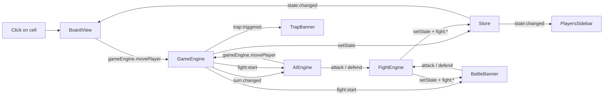

# Architecture

Structure of the code **as it is today** (verified against `src/` on 2026-10-08).

## Layers and allowed dependencies

```text
core/        ← reusable infrastructure (EventBus, Store, Component, Router)
Engine/      ← game logic, ZERO DOM: Rules.js (pure rules) + engines applying them to the Store
AI/          ← agents (ways of playing), GameEnv (fast simulator), Arena (agent vs agent), ZERO DOM
Models/      ← pure factory functions (plain objects, no methods)
Repository/  ← static data, fresh instances on every call
Views/       ← DOM rendering, ZERO business logic
```

| Layer | May import | Must never |
|---|---|---|
| `core/` | other `core/` modules | contain game logic |
| `Engine/` | `core/`, `Models/`, `Repository/`, other `Engine/` modules; `AIEngine` may import `AI/` agents | touch the DOM (`document`, `querySelector`, …); `Rules.js` must not use the Store, EventBus or timers |
| `AI/` | `core/Random.js`, `Engine/Rules.js`, `Models/`, `Repository/`, other `AI/` modules | touch the DOM; use the Store, EventBus or game engines (it must run in Node and Web Workers) |
| `Models/` | other `Models/` | have methods or side effects |
| `Repository/` | `Models/` | return shared references |
| `Views/` | `core/`, `AssetManager`, other `Views/`, `Models/` constants (`DECOR`), `Repository/` (read-only display data) | contain business rules; import `Engine/` (exceptions below) |

**Views allowed to import `Engine/`** (to dispatch user actions only): `GameView`, `BoardView`, `BattleBanner` — see [decisions D-007](decisions.md#d-007--battlebanner-may-import-fightengine).

Layer rules are summarised as golden rules in [`AGENTS.md`](../AGENTS.md) and detailed in [`conventions.md`](conventions.md#layer-rules).

## Directory structure

```text
index.html                         ← loads css/style.css and src/app.js (type="module")
css/style.css                      ← all styles (single file)
assets/
├── border.svg
└── dungeon/                       ← floor, obstacle, characters/, weapons/, bonus/, trap/
src/
├── app.js                         ← entry point, route registration (menu, options, game)
├── AssetManager.js                ← resolves every image path
├── core/
│   ├── EventBus.js                ← pub/sub, on() returns an unsubscribe function
│   ├── Random.js                  ← createRng(seed): seeded random generator (reproducible games)
│   ├── ModelStorage.js            ← trained models ('fight', 'move') saved in localStorage (try/catch, null without a browser)
│   ├── Store.js                   ← centralised state, emits 'state:changed'
│   ├── Component.js               ← base class: render/mount/unmount/listen/query/queryAll
│   └── Router.js                  ← hash-based: register/navigate/start
├── Engine/
│   ├── Rules.js                   ← pure game rules: createGame, applyMove/Pass/Attack/Defend, resolveRound → { state, events }
│   ├── GameEngine.js              ← applies Rules to the Store + emits events (singleton gameEngine)
│   ├── FightEngine.js             ← same for fights, with the 500 ms round delay (singleton fightEngine)
│   ├── AIEngine.js                ← plugs an AI agent into the running game (singleton aiEngine)
│   └── MovementSystem.js          ← pure functions: getMovableCells, getAdjacentPositions
├── AI/
│   ├── ScriptedAgents.js          ← hand-written agents: random, easy, normal (SCRIPTED_AGENTS)
│   ├── GameEnv.js                 ← simulator: reset() / step(action), no delays (training, arena)
│   ├── Arena.js                   ← playGame / runMatch between two agents, seeded
│   ├── QLearning.js               ← generic tabular Q-learning (QTable), reusable for other games
│   ├── FightPolicy.js             ← fight observation (fightStateKey) + trained agent (createQFightAgent)
│   ├── FightTrainer.js            ← Q-learning training of fight decisions (games against an opponent, evaluation)
│   ├── Genetic.js                 ← generic genetic algorithm (GeneticAlgorithm), reusable for other games
│   ├── MoveFeatures.js            ← movement features (visible information only) + weighted movement agent
│   ├── MoveTrainer.js             ← genetic evolution of the movement weights (fitness = win rate)
│   ├── NeuralNetwork.js           ← generic multilayer perceptron written by hand (forward, backprop, SGD / Adam)
│   ├── NeuralMovePolicy.js        ← raw network inputs per reachable cell (5 × 5 view + 9 globals) + neural movement agent
│   ├── ImitationTrainer.js        ← supervised imitation of the genetic champion (distillation, train / test split)
│   ├── DefaultModels.js           ← reference models shipped with the game (genetic champion weights)
│   ├── Balance.js                 ← character balance analysis (every pair, same AI on both sides), step by step
│   ├── balance.worker.js          ← Web Worker running the balance analysis for the Balance lab
│   ├── FightLesson.js             ← training-page lesson "Combat" (wraps FightTrainer)
│   ├── MoveLesson.js              ← training-page lesson "Déplacement" (wraps MoveTrainer, champion demos)
│   ├── NeuralLesson.js            ← training-page lesson "Réseau de neurones" (wraps ImitationTrainer, loss curves)
│   ├── TrainingSession.js         ← speeds and messages for the training page; delegates to a lesson
│   └── training.worker.js         ← Web Worker running a TrainingSession
├── Models/
│   ├── Cell.js                    ← createCell() + DECOR constant
│   ├── Player.js                  ← createPlayer()
│   ├── Weapon.js                  ← createWeapon()
│   ├── Bonus.js                   ← createBonus()
│   └── Trap.js                    ← createTrap()
├── Repository/
│   ├── PlayersRepository.js       ← PLAYER_DATA, findAll() returns fresh instances
│   ├── WeaponsRepository.js       ← WEAPON_DATA
│   ├── BonusRepository.js         ← BONUS_DATA
│   └── TrapRepository.js          ← TRAP_DATA
└── Views/
    ├── MenuView.js
    ├── OptionsView.js             ← OPTIONS and AI_MODES arrays (rendering is generic, no CSS per option)
    ├── GameView.js                ← orchestrates sub-components, starts/stops AI, sizes the board (--cell-size, ResizeObserver)
    ├── BoardView.js               ← event delegation on the board
    ├── PlayersSidebar.js
    ├── BattleBanner.js            ← fight UI, calls fightEngine.attack()/defend(), restarts a game
    ├── TrapBanner.js              ← trap and skipped-turn notices
    ├── TrainingView.js            ← AI training page (#training): drives the Web Worker, chart, policy map, live board
    ├── BalanceView.js             ← Balance lab (#balance): editable character stats, win-rate bars, duel matrix
    └── boardTemplate.js           ← boardHtml(state): board HTML shared by BoardView and TrainingView
training/
├── arena.mjs                      ← CLI: scripted agents against each other (win rates, games/s)
├── train-fight.mjs                ← CLI: Q-learning of fight decisions, progress table, learned policy
├── train-move.mjs                 ← CLI: genetic evolution of the movement, progress table, champion weights
├── train-imitation.mjs            ← CLI: neural network imitating the champion, loss / accuracy / win rate per epoch
├── balance.mjs                    ← CLI: character balance analysis (uses src/AI/Balance.js, CSV matrix)
                                     (the CLIs write their models to ../BoardGameReborn-output/training/)
tools/
└── ui-check.mjs                   ← responsive UI check with headless Chrome (D-009); screenshots in ../BoardGameReborn-output/ui-check/
tests/
├── helpers.mjs                    ← builds controlled game states, records events
└── *.test.mjs                     ← one file per engine (node:test), see D-008
```

> Note (migration): the previous `CLAUDE.md` did not list `AIEngine.js`, `aiMode` or `isAI`. Added here from the code.

## Core infrastructure

### EventBus

`eventBus.on(event, cb)` returns an unsubscribe function; `off(event, cb)`; `emit(event, payload)`.

### Store

- `store.state` — read-only getter.
- `store.setState(updater)` — the **only** way to change state. `updater(state)` returns a partial object that is shallow-merged, then `state:changed` is emitted with the full state.
- `store.reset()` — restores the initial state (called by `GameView.onUnmount()`), emits `state:changed`.

### Component

```js
class MyComponent extends Component {
    render() { return `<div>HTML</div>`; }  // returns HTML
    onMount() { /* DOM events, this.listen(...) */ }
    onUnmount() { /* cleanup, called by unmount() */ }
}
```

- `listen(event, cb)` registers an EventBus subscription that is automatically removed on `unmount()`.
- `query(selector)` / `queryAll(selector)` search inside the component root.
- The constructor accepts a CSS selector or a DOM element as root.

### Router

```js
router.register('menu', () => new MenuView('#app')).start();
router.navigate('game'); // unmounts the current view, mounts the new one
```

Hash-based (`#menu`, `#options`, `#game`, `#training`, `#balance`); default route is `menu`; listens to `popstate`.

## Events

| Event | Emitter | Payload |
|---|---|---|
| `game:started` | GameEngine | — |
| `turn:changed` | GameEngine | `{ activePlayerIndex }` |
| `trap:triggered` | GameEngine | `{ playerInfo }` |
| `turn:skipped` | GameEngine | `{ playerInfo }` (blocked player, emitted before `turn:changed`) |
| `fight:start` | GameEngine | `{ attacker, target }` |
| `fight:attack` | FightEngine | `{ attacker, target, damage }` |
| `fight:defend` | FightEngine | `{ attacker, target }` |
| `fight:round-end` | FightEngine | `{ nextAttacker, nextTarget }` |
| `fight:end` | FightEngine | `{ winner, loser }` |
| `state:changed` | Store | full `state` |

Events are produced by the pure rules (`Rules.js`) and emitted by `GameEngine` / `FightEngine` after the Store is updated.

Main listeners: `BoardView` (`game:started`, `state:changed`), `PlayersSidebar` (`game:started`, `state:changed`), `BattleBanner` (`fight:*`), `TrapBanner` (`trap:triggered`, `turn:skipped`), `AIEngine` (`turn:changed`, `fight:start`, `fight:round-end`).

## State shape

```js
{
  phase: 'menu' | 'playing' | 'fighting' | 'gameover',
  config: { rows, cols, nbObstacles, nbWeapons, nbBonus, nbTraps, aiMode }, // aiMode: 'none' | 'easy' | 'normal' | 'trained'
  cells: Cell[][],        // 2D array of plain objects
  players: PlayerInfo[],  // [{ player, position: { row, col } }]
  activePlayerIndex: number,
  fight: { attackerIndex, targetIndex } | null,
}
```

Initial values live in `createInitialState()` in `src/core/Store.js`.

## Data flow



AI training page: `TrainingView` ⇄ messages ⇄ `training.worker.js` → `TrainingSession` → `FightTrainer` → `GameEnv` → `Rules.js` (no Store, no EventBus). "Utiliser dans le jeu" saves the Q-table with `ModelStorage`; `AIEngine.start()` loads the saved models for the `trained` mode: fight table and one movement model (evolved weights or neural network, the last one saved), Normal's rule for whatever is missing.

Game start: `OptionsView` writes `config` to the Store → `router.navigate('game')` → `GameView.onMount()` mounts sub-components, calls `aiEngine.start()`, then `gameEngine.startGame(config)`, then computes `--cell-size`.

## Data model

| Model | Factory | Fields |
|---|---|---|
| Cell | `createCell(row, col)` | `id` (`"row-col"`), `row`, `col`, `decor` (`DECOR.FLOOR` / `DECOR.OBSTACLE`), `weapon`, `bonus`, `player`, `trap` (`null` or `{ name, image, triggered }`), `isMovable`, `isSecurityZone` |
| Player | `createPlayer(name, health, image, maxMove, { strength, agility, intelligence, luck })` | `name`, `health`, `maxHealth`, `defense`, `weapon` (default "Épée de boisaille", 10 dmg), `image`, `maxMove`, `strength`, `agility`, `intelligence`, `luck` (combat stats, 0 by default), `isAI` |
| Weapon | `createWeapon(name, damage, image)` | `name`, `damage`, `image` |
| Bonus | `createBonus(name, type, amount, image)` | `type`: `'move'` or `'life'` |
| Trap | `createTrap(name, image)` | `name`, `image`, `triggered: false` |

## Asset resolution

All images live in `assets/` (local to the project). Paths are resolved only through `src/AssetManager.js` (base `assets/dungeon`): `floor()`, `obstacle()`, `player(p)`, `weapon(w)`, `bonus(b)`, `trap(t)`.
